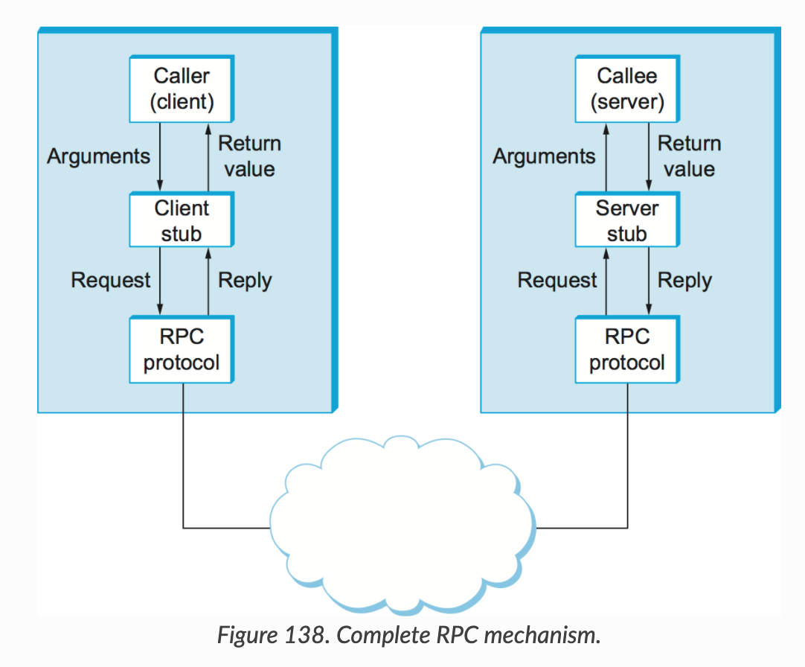

`API(Application Programming Interface)`는 **서비스와 서비스끼리 통신하기 위해, 즉 요청과 응답을 주고받기 위해 정의된 다양한 종류의 인터페이스**이다. '다양한 서비스가 만나는 지점'이자 '서비스의 동작을 정의한 일종의 약속'이라고도 표현할 수 있을 것 같다. 실제 서비스를 제공하기 위해서는 무수히 많은 소프트웨어 서비스가 맞물려서 운영되어야 하기 때문에, 구체적이고 확장성이 높은 API를 정의하는 것은 매우 중요하다.

<br>

## API는 어떤 방식으로 동작할까?

API는 클라이언트와 서버 사이에서 요청과 응답을 통해 리소스를 주고받는 방식으로 동작한다.  
API를 구성하는 요소들은 아래와 같다.

### 자원(resource)
'이 리소스를 어떻게 명확하게 표현할 수 있을지?'가 바로 API가 풀어내야 할 과제가 된다. 여기서 **리소스는 DB에 저장된 데이터 자체가 아닌, 데이터의 상태를 클라이언트가 요청한 방식에 맞추어 표현하여 전달한 응답**이다. 리소스는 JSON 데이터일수도, 이미지일수도 또는 어떠한 문서일수도 있다.

### 동작(method)
또한 리소스에 대해 **어떤 동작을 수행할 것인지를** 정의한다. 리소스를 생성(`POST`)할 것인지, 단순히 가져올 것인지(`GET`)와 같은 행위를 명시해야 한다.


<br>

## API의 종류에 대해 알아보자

API의 형식은 게속해서 발전하여 왔다. 그 중 가장 보편화된 3가지 방식에 대해 설명해보려 한다.


<br>

### REST(REpresential State Transfer)

`REST(REpresential State Transfer)`는 HTTP 프로토콜 위에서 동작하는, 가장 보편적으로 쓰이는 API 형식이다. URL과 HTTP method(`GET`, `POST`, `PATCH`, `DELETE`)를 사용하여 리소스에 접근한다. 

`REST`는 **stateless**한 특징을 가지며 **caching**을 적용하여 클라이언트와 서버가 지속적으로 연결을 수립할 필요가 없게 구현할 수 있다. 또한 다양한 프로그래밍 언어로 구현할 수 있고, 일반 텍스트, `HTML`, `YAML`, `XML`, `JSON`과 같이 **다양한 포맷으로 리소스를 주고받을 수 있다**는 장점이 있다. 주로 JSON 포맷으로 데이터를 주고 받는다. 

반면, <text style="color:#000066;">**클라이언트는 언제나 요청된 endpoint에서 정의된 리소스만 받아올 수 있다는 단점도 있다.**</text>
한 번의 요청에 불필요한 리소스까지 모두 포함되거나(over-fetching), 클라이언트가 필요로 하는 데이터를 얻기 위해서는 여러 번의 서로 다른 요청(under-fetching)을 보내게 될 수 있는 것이다.

``` bash
# curL을 사용한 REST API 요청
curl -i -X GET http://localhost:8080/api/books
```
<br>

### GraphQL

Facebook에서 개발한 API를 위한 query 언어이다.
REST API와 달리 리소스에 대한 별도의 endpoint가 존재하지 않고, **하나의 endpoint만 존재**한다.  

필요한 컬럼에 대해서만 선택적으로 요청을 보낼 수 있어 클라이언트가 필요로 하는 데이터만 받을 수 있다는 것이 가장 큰 장점이다. 여러 depth로 구성된 데이터에 접근하는 경우에도, 요청을 여러 번 보내지 않고 효율적으로 리소스를 주고 받을 수 있다. ***즉, 사용자는 한 번의 요청만으로 원하는 데이터를 전부 응답받을 수 있다.***

또한 HTTP Method에 따라 리소스에 대한 접근 방식이 달랐던 REST API는 달리 `POST` method만을 사용하여 `Query`, `Mutation`, `Subscription` 3가지 방식으로 동작한다.
- `Query`: 데이터를 요청할 때 사용하는 방식
    ``` bash
    # curL을 사용한 GraphQL query 요청
    curl  'http://snowtooth.herokuapp.com/'
    -H 'Content-Type: application/json'
    --data '{"query":"{ query { books {id, name}}}"}'
    ```
- `Mutation`: 데이터를 조작할 때(`INSERT`, `UPDATE`, `DELETE`) 사용하는 방식
    ``` bash
    curl 'http://snowtooth.herokuapp.com/'
    -H 'Content-Type: application/json'
    --data '{"query":"mutation {setLiftStatus(id: \"panorama\" status: OPEN) {name status}}"}'
    ```
- `Subscription`: websocket을 통해 실시간 양방향 통신을 구현할 때 사용하는 방식
<br>

### gRPC(Google Remote Procedure Call)

Google에서 개발한 `RPC(Remote Procedure Call)` 프레임워크이다.



**Stub 컴파일러가 `IDL(Identity Definition Language)` 호출규약을 정의하고 파라미터를 `Marshalling`/`UnMarshalling` 처리하여 RPC 프로토콜로 전달**한다. IDL에서 정의된 포맷에 따른 메세지를 주고받으며 단순히 `JSON`을 사용하는 것보다 일괄성 있게 데이터를 주고받을 수 있다.  
> **_Marshalling/UnMarshalling_:** 데이터를 byte로 변환하고, 전송받은 byte 데이터를 복구하는 일련의 과정을 말한다. 데이터를 byte stream으로 변환하는 데이터와는 달리, 변환할 대상과 object가 한정되지 않는다는 특징이 있다.
<br>

 주로 `Protobuf(Protocol buffers)`를 사용한다. 
> **_Proto Buffer_:** 언어와 플랫폼에 관계없이 구조화된 데이터를 직렬화하기 위한 방법으로, 문자를 16진수로 인코딩하여 표현한다. 데이터의 크기가 작으며 parsing을 할 필요가 없으므로 통신이 빠르다. 반면, key-value쌍으로 손쉽게 작성할 수 있는 JSON 포맷과는 달리 별도의 문법을 사용해야 하며 16진수로 변환되기 때문에 직관적이지 않다는 단점이 있다.

``` go
// protobuf.proto

// syntax: 사용할 문법을 선언
syntax = "proto3";
package pkg_name;
option go_package = "pkg_path";

// service: 사용할 메소드를 선언 (stream을 사용해 통신방식을 일부 다르게 적용할 수 있음)
service User {
    // unary: 한 번의 호출에 대해 한 번 응답
    rpc GetUser(GetUserRequest) returns (GetUserResponse);
    // client-stream: 클라이언트에서 서버로 stream을 전달하고, 서버에서는 한 번 응답
    rpc GetUser(stream GetUserRequest) returns (GetUserResponse);
    // server-stream: 클라이언트에서 한 번 전달, 서버에서는 stream으로 응답
    rpc GetUser(GetUserRequest) returns (stream GetUserResponse);
    // bidirectional stream: 클라이언트와 서버 모두에서 stream으로 요청, 응답
    rpc GetUser(stream GetUserRequest) returns (stream GetUserResponse);
}
// message: object 정의
message UserMessage {
    string user_id = 1;
    string name = 2;
    string phone_number = 3;
    int32 age = 4;
}
message GetUserRequest { string user_id = 1; }
message GetUserResponse { UserMessage user_message = 1; }
```
<br>

`gPRC`는 `HTTP/1.1`을 기반으로 하는 REST API와는 달리 `HTTP/2` 프로토콜을 사용한다. `HTTP/2.2` 기반으로 동작함에 따라 메세지를 binary 형태로 인코딩하여 주고받는다. 또한 하나의 TCP 연결에 대해 여러 개의 양방향 스트림(`bidirectional streams`)을 지원하는, blocking없이 여러 요청과 응답을 병렬적으로 수행할 수 있는 `Multiplexing` 개념이 적용되는 프레임워크이다.

<br>

## 어떠한 API를 사용해야 하는 것일까?

아래와 같은 요소들을 고려하여, 개발하고자 하는 서비스의 특성을 극대화할 수 있는 방법을 선택하면 된다.
- **데이터 포맷(Data Format)**: REST의 JSON 포맷의 경우 접근성이 좋다는 장점이 있는 반면 일관성을 유지하기는 쉽지 않다는 단점이 있다. GraphQL 역시 기본적으로 JSON 포맷을 사용한다. gRPC의 protocol buffer의 경우, 구조화된 포맷을 적용할 수 있으며 언어에 구애받지 않는다는 장점이 있지만, human-readable하지는 않다는 단점도 있다.
- **데이터 가져오기(Data Fetching)**: GraphQL의 경우 클라이언트가 필요로 하는 데이터만 요청하여 받아올 수 있으므로, fetching에 가장 용이하다. 반면 REST나 gRPC의 경우 서버에서 정의한 방식대로 데이터를 요청하고 응답받을 수 있으므로 over-fetching이나 under-fetching 문제가 발생할 수 있다.
- **브라우저 지원(Browser Support)**: REST와 GraphQL의 경우, 모든 브라우저에서 지원이 가능하다. 반면, gRPC에 대한 브라우저 지원은 기본적으로 제공되지 않는다. 별도의 클라이언트를 구현해야 한다.
- **응답 시간(Response Time)**: gRPC는 REST나 GraphQL에 비해 응답시간이 매우 빠르다. 또한 HTTP/2.0을 기반으로 동작하므로 지연 시간이 적고, 새로운 TCP 연결을 수립하지 않고도 여러 요청을 주고 받을 수 있어 성능적 측면에서 우수하다.
- **캐싱(Caching)**: 요청과 응답에 대한 캐싱을 가장 쉽게 구현할 수 있는 방법은 REST이다. GET 요청에 대해 브라우저나 proxy server, CDN을 사용하여 손쉽게 캐싱을 적용할 수 있다. 반면 POST를 기본 method로 사용하는 GraphQL이나 기본적으로 캐싱을 제공하지 않아 별도의 middleware를 구현해야 하는 gRPC의 경우, 상대적으로 캐싱을 적용하기 위해 많은 비용이 소모된다.

필요에 따라 여러 API 형식을 혼합하여 사용할 수도 있다.


<br>

## References
- https://www.baeldung.com/rest-vs-graphql-vs-grpc
- https://www.altexsoft.com/blog/soap-vs-rest-vs-graphql-vs-rpc/
- https://code.tutsplus.com/tutorials/rest-vs-grpc-battle-of-the-apis--cms-30711

``` toc
``` 