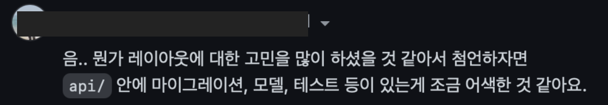

장고는 하나의 프로젝트 내에 여러 개의 app이 존재하는 구조이다.
`python manage.py startapp [appname]` 명령으로 app을 생성한 뒤, `settings.INSTALLED_APPS`에 생성한 app을 등록하여 손쉽게 관리할 수 있다.


아래의 이미지는 명령어를 통해 app을 생성했을 떄의 기본 구조이다.  
루트 디렉토리에 장고 서버를 구동하기 위해 필요한 `manage.py` 파일이 존재하고,
생성된 app 디렉토리 내부에 `Model`, `View`, `Test`, `Migration`과 같은 파일이 생성된다.

``` bash
.
├── app
│   ├── __init__.py
│   ├── admin.py
│   ├── apps.py
│   ├── migrations
│   │   └── __init__.py
│   ├── models.py
│   ├── tests.py
│   └── views.py
├── djangoProject
│   ├── __init__.py
│   ├── asgi.py
│   ├── settings.py
│   ├── urls.py
│   └── wsgi.py
├── manage.py
```

<br>

새로운 사이드 프로젝트를 사용하면서도 이러한 디렉토리 구조를 그대로 사용하고 있었는데, 프로젝트가 정리되어 있지 않은 느낌이 있다는 피드백을 들었다.

하지만 `url`과 `settings`를 개발용/운영용 환경으로 분리하는 것 외에 프로젝트 구조를 유연하게 설정할 수 있는 방법이 어떤 것이 있을지 감히 잡히지가 않았다. "장고는 프로젝트를 app 단위로 나누어 관리하니까, app을 더 쪼개야 하는건가? 아니면 합쳐서 단순화해야 하는걸까?\"와 같은 고민을 하다가..  

**app을 생성하고 디렉토리가 많아지면서 프로젝트 구조가 난잡하다라는 생각이 종종 들었으니, api를 버전별로 관리할 수 있도록 이 app들을 전부 하나의 폴더에 넣어서 관리하면 단순해지겠다!** 라는 생각으로 api 디렉토리 안에 app을 전부 우겨넣었다. <text style="color:grey;">**정말 근거도, 기준도 없는 아주 무식한 리팩토링 아이디어였다.**</text>

이후에 추가로 피드백을 받았다.



app 단의 코드와 api 단의 코드 파일을 분리해서 관리하는 접근법은 생각도 못했다. ~~(이게 바로 혼자 하는 사이드 프로젝트의 한계.. 내 수준 안에서 생각이 갇혀버린다)~~

<br>

구조 리팩토링의 결과물이다.
`apps` 디렉토리 내부에는 `Model`, `Migration`, `Test` 파일을,  
`api` 디렉토리 내부에는 `View`, `Serializer`, `Service`, `Url`과 같이 서비스 로직과 관련된 파일을 넣어 구조를 분리하였다.

또한 인프라 관리를 위해 필요한 설정 파일을 관리하기 위해 `config/`라는 별도의 디렉토리를 생성하고, 어플리케이션 동작을 위해 추가로 정의한 `response renderer`나 `exception handler`와 같은 모듈을 `utils/`에 포함시켜서 `setting`을 조금 가볍게 가져가도록 개선하였다.


``` bash
├── api
│   ├── main/
│   ├── contents/
│   ├── users/
│   └── urls.py
├── apps
│   ├── __init__.py
│   ├── contents/
│   └── users/
├── config/
├── logs/
├── manage.py
├── requirements.txt
├── djangoProject
│   ├── __init__.py
│   ├── asgi.py
│   ├── authentication.py
│   ├── middleware.py
│   ├── settings
│   ├── urls.py
│   └── wsgi.py
├── scripts/
└── utils/
```

<br>

이후에 닉네임 중복확인, 코드 유효성 검증과 같은 `validation` 관련 기능을 추가할 때 별도의 app 생성 없이도 api를 유연하게 확장할 수 있었다.

api 버전 자체를 업그레이드하여 프로젝트를 고도화하려는 경우에도 루트 디렉토리에서 version에 대한 상위 폴더를 생성하여 관리하도록 개선할 수 있으므로 확장성 측면에서도 꽤 괜찮은 구조로 리팩토링 된듯 하다!
