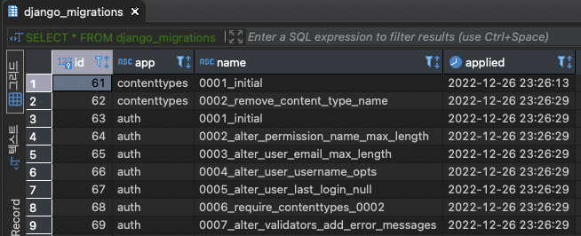
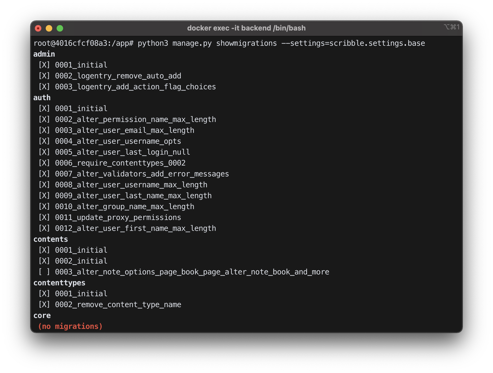

기능을 추가하며 모델을 변경해야 할 일이 새겼다.
테이블을 수정하고 migration을 적용하면서 dependency 오류부터 relationExists 오류까지 아주 난항을 겪었다.

사실 토이프로젝트에서는 migration이 꼬이면 그냥 전부 밀어버리고 다시 적용하면 그만이었다.
하지만 실제로 배포되고 데이터가 담겨 있는 DB의 테이블을 수정하는 경우에는 이런 1차원적인 방식으로 접근할 수는 없었다.

다소 긴 삽질의 과정을 경험하며, 내가 migration에 대하여 정확히 이해를 하지 못하고 있음을 깨달았다.

<br>

## Migration이란?
일종의 database version control log라고 이해하면 될 것 같다. 
`python manage.py makemigrations` 명령어를 수행하면 각 app의 모델에 대한 변경사항을 기록한 python script가 자동으로 생성되고

``` bash
$ python manage.py makemigrations [app_name]
Migrations for 'users':
  apps/users/migrations/0002_user_auth_id_user_social_type.py
    - Add field auth_id to users
    - Add field social_type to users
```

`python manage.py migrate` 명령어를 수행하면 db에 변경사항을 반영할 수 있다.
이 migration script는 `000X_changelog_contents_whatever.py` 형식으로 네이밍되며,
모델 간의 관계(생성 순서, 참조 방향 등)를 고려하여 순차적으로 dependency가 존재한다.


예를 들어, `BookObject` 테이블에서 `User` 테이블을 FK로 참조하고 있는 경우라면
반드시 `User` 테이블의 생성이 선행되어야만 `BookObject` 테이블을 참조할 수 있다.

``` python
class User(AbstractUser, TimeStampModel):
    username = None
    email = models.EmailField(
        max_length=255,
        verbose_name='이메일',
        validators=[SpecificEmailDomainValidator(allowlist=domain_allowlist)]
    )
    
class BookObject(TimeStampModel):
    user = models.ForeignKey(
        User,
        on_delete=models.CASCADE,
        related_name='note',
        verbose_name='작성자'
    )
```

따라서 `BookObject` app의 migration에는 다음과 같은 dependency(`users.migrations.0001_initial.py` 을 적용한 후에 해당 migration을 적용할 수 있음)가 명시되어 있다.

``` python
class Migration(migrations.Migration):
    initial = True
    dependencies = [
        ('users', '0001_initial'),
    ]
```

<br>

## 적용된 migration 확인하기
migration 적용 내역은 `django_migrations` 테이블에 저장되는데
이 때 데이터베이스에 migration 내용은 저장되지 않는다. 적용 순서, script명, 시간 정도의 데이터만 확인할 수 있다.




따라서 이미 적용된 migration script를 수정한 뒤 다시 migrate를 수행한다고 해도 `django_migration` 테이블에 변경 내용은 저장되지 않는다.
데이터베이스에 수정 내용이 반영되지 않고 충돌이 일어날 수도 있다.

`python manage.py showmigrations` 를 통해서도 한눈에 migration 적용상태를 확인할 수 있다.



<br><br>

## 이미 적용된 migration을 Revert하고 싶은 경우?

아래와 같이 Revert하고자 하는 app의 이름과 migration 번호를 명시하면 된다.

``` bash
$ python manage.py migrate [app_name] [number]

```
예를 들어 0004까지 migration이 적용되어 있는 User app이 있다고 하자.
`python manage.py migrate users 0002` 라는 명령을 수행하면, 0003 이후의 migration은 unapply되고 0002 migration 기준으로 데이터베이스가 동작한다

이 때, 주의하여야 할 점은 되돌리고자 시점 이후에 대한 migration script를 절대 삭제해서는 안된다는 것이다!
데이터베이스는 사용자가 입력한 명령을 <b>존재하지도 않는 migration을 revert하려는 것</b>으로 이해할 것이다.
삭제된 migration을 복구할 수 없는 경우라면 직접 데이터베이스의 테이블을 수정해야 한다.


<br>

## 이미 적용된 migration 내용을 수정하고 싶은 경우?

n번째 migration 적용 내역을 수정하고 싶다면 어떻게 하면 될까?
n+1번째의 새로운 migration script를 생성하면 된다. 위에 언급한 것처럼
이미 적용된 migration을 수정하는 것은 데이터베이스에 충돌을 불러올 수도 있고, 이후에 적용할 migration에서 충돌이 발생할 수도 있다.

그래도 n번째로 적용된 migration을 수정하는 방향으로 개발을 하고 싶다면,
이전 n-1번째 version으로 revert를 수행한뒤에 새롭게 n번째 migration script를 생성하고 적용하면 된다.

<br>

## migration을 Squash하여 log를 관리하고 싶은 경우?

`python manage.py squashmigrations`를 사용하여
존재하는 많은 수의 migration을 한 개(또는 그 이상)의 migration으로 합쳐서 관리할 수 있다.

예를 들어 `CreateModel`과 `DeleteModel` action을 합칠 수 있고, `AddField` action을 `CreateModel` 내부로 roll 시킬 수 있을 것이다.

squash된 migration과 이전 버전의 migration log는 동시에 존재할 수 있다.
Django는 migration이 적용되는 시점을 자동으로 파악하여 새로운 version에서는 squash된 migration을 적용하고 이전 버전의 migration을 skip한다.

`--squashed-name` 옵션을 사용하여 squash할 migration script의 이름을 지정할 수도 있다.

``` bash
$ python manage.py squashmigrations [app_name] [number] --squaushed_name [SQUASHED_NAME]
Will squash the following migrations:
 - 0001_initial
 - 0002_some_change
 - 0003_another_change
 - 0004_undo_something
Do you wish to proceed? [y/N] y
Optimizing...
  Optimized from 12 operations to 7 operations.
Created new squashed migration /home/andrew/Programs/DjangoTest/test/migrations/0001_squashed_0004_undo_somthing.py
  You should commit this migration but leave the old ones in place;
  the new migration will be used for new installs. Once you are sure
  all instances of the codebase have applied the migrations you squashed,
  you can delete them.
```

<br>

``` toc
```