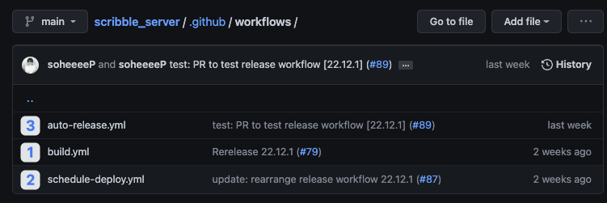
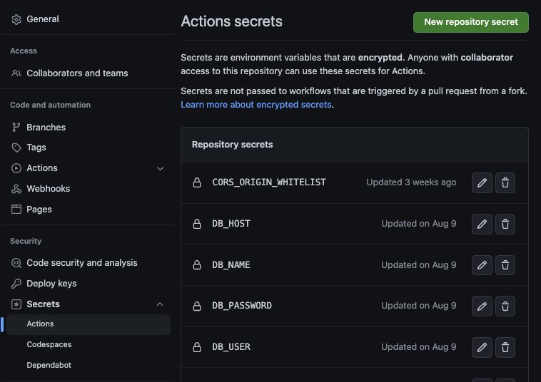
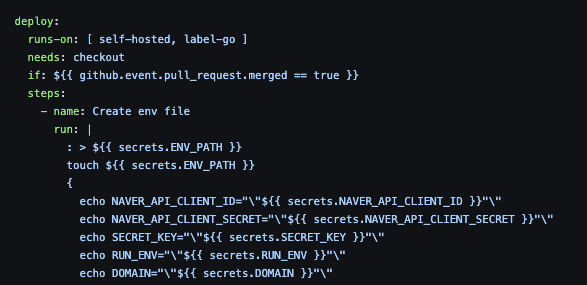
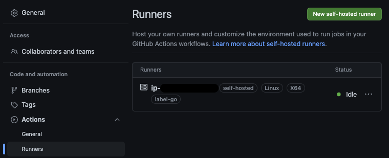
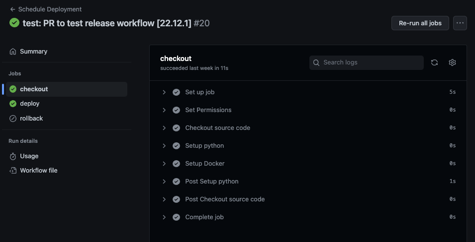

Github Action은 <b>build, test, deployment와 같은 workflow를 자동화할 수 있는 CI/CD 플랫폼</b>으로,
github repository에서 발생하는 모든 이벤트(push, pull request, merge 등)에 대하여 정해진 동작을 실행시키도록 할 수 있다.

진행중인 프로젝트에서는 `docker-compose`를 이용해 서비스 컨테이너들을 관리하고 있다.
소스코드가 수정될 때마다 수동으로 컨테이너를 삭제하고 빌드하는 방식으로 테스트 서버를 운영하다가 `Github Action`을 사용하여 CI/CD를 자동화해보기로 했다.

<br>

## CI/CD 프로세스 설계해보기

다음과 같은 프로세스들을 자동화시키려 하였다.

*github/workflow에 YAML파일 생성*

1. 생성된 pull request에 대하여 <b>자동으로 build 테스트를 수행</b> → 실패시 merge 불가
2. main branch에 pull request가 merge된 경우, 
   a) production 서버에 동작하던 컨테이너를 중지 / dangling image를 삭제하여 서버 여유공간 확보
   b) production 서버에 <b>새로운 container들을 빌드</b>
   c) container가 정상적으로 동작하지 않는 경우, <b>rollback</b>
3. pull request를 활용한 소스코드 <b>release, tag 생성 및 관리 자동화</b>

<br>

## Github를 활용한 CI/CD 환경 관리 

`Repository > Settings > Secrets`를 사용하여 환경변수를 세팅한다.
workflow에서 env 파일을 생성하고 비밀키 값들을 넘겨주는 방식으로 관리했다.







아래와 같이 repository에 Self-Hosted Runner를 등록하여 관리 중인 서버에서 자동으로 빌드와 배포를 수행하도록 하였다.
runner는 프로젝트의 EC2 instance에서 daemon으로 동작하고 있다.



<br>

## Workflow 구현하기

1. `build.yml`
    - 생성된 pull request에 대하여 자동으로 build 테스트를 수행하는 workflow
    - ubuntu 환경 구성 / container의 동작을 관리하는 shell script를 수행하는 step을 실행하도록 구현

    ``` yaml
    name: Build Test
    on: [pull_request]  # pull request event에 대하여 trigger되는 workflow
    jobs:
    build:
        runs-on: ubuntu-latest
        steps:
        # 프로젝트 소스코드를 리눅스 환경에 checkout하고 실행하도록 명시
        - name: Checkout source code
            uses: actions/checkout@v3
            
        # 해당 workflow를 python3.8 환경에서 실행하겠다고 명시
        - name: Setup python
            uses: actions/setup-python@v3
            with:
            python-version: "3.8"
        
        # 리눅스 환경에 docker를 세팅하는 shell script를 실행
        - name: Setup Docker
            run: sh scripts/setup-docker.sh

        # ${{ secrets.* }} 변수를 사용하여 Settings > Secrets > Actions에 정의한 값을 가져오고
        # .env파일을 생성하여 dev환경의 환경변수를 관리
        - name: Create env file
            run: |
            touch ${{ secrets.ENV_PATH }}
            {
                echo SECRET_KEY="\"${{ secrets.SECRET_KEY }}"\"
                echo RUN_ENV="\"${{ secrets.RUN_ENV }}"\"
                echo DOMAIN="\"${{ secrets.DOMAIN }}"\"
                echo PROD_ALLOWED_HOSTS='${{ secrets.PROD_ALLOWED_HOSTS }}'
                echo CORS_ORIGIN_WHITELIST='${{ secrets.CORS_ORIGIN_WHITELIST }}'
                ...
            } >> ${{ secrets.ENV_PATH }}
        
        # containter를 빌드하고 배포하는 shell script를 수행
        - name: Build Docker containers
            run: sudo kill `sudo lsof -t -i:8084` && sh scripts/build-docker-compose.sh

        # container의 동작 상태를 확인한 뒤 job을 종료
        - name: Check container running state
            run: |
            if [ $(docker ps --format "{{.Names}} {{.Status}}" | grep "Up" | wc -l) -ne 3 ]
            then
                echo "Build error while running docker-compose"
                exit 1
            else
                echo "Deploy Complete"
            fi
    ```

2. `schedule-deploy.yml`
    - production 서버에 동작하던 컨테이너를 중지 / dangling image를 삭제하여 서버 공간을 확보하는 동작을 별도의 shell script로 작성하여 workflow의 step에서 실행
    - production 서버에 새로운 container들을 빌드 및 배포한뒤 동작 상태를 확인
    - 정상적으로 동작하지 않는 경우, 이전 버전의 release로 rollback

    ``` yaml
    name: Schedule Deployment
    on:     # main branch를 target으로 하는 pull request가 closed되었을 경우에만 동작하는 workflow
    pull_request:
        branches:
        - main
        types:
        - closed
    jobs:
    checkout:
        # 프로젝트를 build할 machine(runner)를 명시
        runs-on: [ self-hosted, label-go ]
        # pull request가 merge된 경우에만 checkout job을 수행
        if: ${{ github.event.pull_request.merged == true }}
        steps:
        # runner가 workflow를 수행할 수 있도록 workspace에 permission 부여
        - name: Set Permissions
            run: sudo chown -R $USER:$USER ${{ github.workspace }}

        # 프로젝트 소스코드를 리눅스 환경에 checkout하고 실행하도록 명시
        - name: Checkout source code
            uses: actions/checkout@v3
            
        # 해당 workflow를 python3.8 환경에서 실행하겠다고 명시
        - name: Setup python
            uses: actions/setup-python@v3
            with:
            python-version: "3.8"

        # 리눅스 환경에 docker를 세팅하는 shell script를 실행
        - name: Setup Docker
            run: sh scripts/setup-docker.sh

    deploy:
        runs-on: [ self-hosted, label-go ]
        # checkout job이 완료되었을 경우 동작하도록 의존관계를 설정 
        needs: checkout
        if: ${{ github.event.pull_request.merged == true }}
        steps:
        # ${{ secrets.* }} 변수를 사용하여 Settings > Secrets > Actions에 정의한 값을 가져오고
        # .env파일을 생성하여 dev환경의 환경변수를 관리
        - name: Create env file
            run: |
            touch ${{ secrets.ENV_PATH }}
            {
                echo SECRET_KEY="\"${{ secrets.SECRET_KEY }}"\"
                echo RUN_ENV="\"${{ secrets.RUN_ENV }}"\"
                echo DOMAIN="\"${{ secrets.DOMAIN }}"\"
                echo PROD_ALLOWED_HOSTS='${{ secrets.PROD_ALLOWED_HOSTS }}'
                echo CORS_ORIGIN_WHITELIST='${{ secrets.CORS_ORIGIN_WHITELIST }}'
                ...
            } >> ${{ secrets.ENV_PATH }}

        # container를 빌드하고 배포하는 shell script를 수행
        - name: Build Docker containers
            run: sh scripts/build-docker-compose.sh
    
        # container의 동작 상태를 확인한 뒤 job을 종료
        - name: Check container running state
            run: |
            if [ $(docker ps --format "{{.Names}} {{.Status}}" | grep "Up" | wc -l) -ne 3 ]
            then
                echo "Build error while running docker-compose"
                exit 1
            else
                echo "Deploy Complete"
            fi

    rollback:
        runs-on: [ self-hosted, label-go ]
        # checkout, deploy job이 모두 완료되었을 경우 동작하도록 의존관계를 설정 
        needs: [ checkout, deploy ]
        # 의존관계가 설정되어 있는 job들 중 하나라도 실패하였을 경우 동작하도록 조건 설정
        if: ${{ always() && contains(needs.*.result, 'failure') }}
        steps:
        # runner가 workflow를 수행할 수 있도록 workspace에 permission 부여
        - name: Set Action Runner Permissions
            run: sudo chown -R $USER:$USER ${{ github.workspace }}

        # rollback job을 수행하기 위하여 마지막으로 release된 버전의 소스코드를 fetch
        - name: Fetch Latest Release
            id: fetch-latest
            uses: thebritican/fetch-latest-release@v1.0.3
            with:
            github_token: ${{ secrets.GITHUB_TOKEN }}

        # fetch-latest step에서 fetch한 버전의 소스코드로 checkout
        - name: Checkout Latest Release source code
            uses: actions/checkout@v3
            with:
            ref: ${{ steps.fetch-latest.outputs.tag_name }}

        # container를 빌드하고 배포하는 shell script를 수행
        - name: Build Docker containers
            run: sh scripts/build-docker-compose.sh

        # container의 동작 상태를 확인한 뒤 job을 종료
        - name: Check container running state
            run: |
            if [ $(docker ps --format "{{.Names}} {{.Status}}" | grep "Up" | wc -l) -ne 3 ]
            then
                echo "Build error while running docker-compose"
                exit 1
            else
                echo "Deploy Complete"
            fi
    ```

3. `auto-release.yml`
    - pull request를 활용한 소스코드 release, tag 생성 및 관리 자동화


    ``` yaml
    name: Auto Release
    on:  # pull request가 opened / reopened / synchronize / edited / closed되었을 때 동작하는 workflow
    pull_request:
        types: [opened, reopened, synchronize, edited, closed]

    jobs:
    release:
        runs-on: ubuntu-latest
        # pull request가 target으로 하는 branch가 main일 경우에만 수행되도록 조건을 설정
        if: ${{ contains(github.base_ref, 'main') || contains(github.ref, 'main') }}
        steps:
        # workflow를 실행하기 위해 필요한 코드에 대해서만 sparse checkout 수행
        - name: Sparse-checkout
            uses: lablup/sparse-checkout@v1
            with:
            patterns: |
                scripts
        # release할 version명을 output으로 저장하는 step 수행
        - name: Extract version
            id: extract-version
            run: |
            # release명은 pull request의 title에 명시된 '숫자.숫자.숫자' 포맷으로 설정
            # 해당 규칙을 준수한 release명이 존재하지 않거나, 잘못된 값이 입력되어 있는 경우에는 이후의 step을 모두 skip
            version=$(echo '${{ github.event.pull_request.title }}' | egrep -o '[0-9]{1,3}\.[0-9]{1,3}\.[0-9]{1,3}')
            echo "::set-output name=version::$version"

        # 현재 branch와 이전 버전 release 사이의 commit log들을 CHANGELOG_RELEASE.md에 저장하고
        # 존재하던 CHANGELOG.md를 업데이트하는 python script를 실행
        - name: Auto Generate Changelog
            id: changelog
            if: ${{ steps.extract-version.outputs.version }}
            run: |
            python3 ./scripts/generate_changelog.py --version "${{ steps.extract-version.outputs.version }}" --tag "${{ github.head_ref }}"

        # CHANGELOG_RELEASE.md에 변경내용이 존재하는지, 즉 새로운 버전의 release를 생성할 필요가 있는지 확인
        # 해당 workflow에서 설정한 github action(pull request)가 close되고,
        # extract-version step에서 올바른 형태의 버전명을 얻어낸 경우에만 수행하도록 조건을 설정
        - name: Get Changed Files
            id: changed-files
            if: ${{ github.event.action != 'closed' && steps.extract-version.outputs.version }}
            uses: tj-actions/changed-files@v31

        # 이전 step인 changed-files에서 변경된 파일이 있는 경우, 파일을 staged 상태로 전환한뒤 자동으로 커밋
        # 이 때, 커밋할 파일(CHANGELOG.md)과 커밋 메세지는 with 구문을 사용하여 지정 
        - name: Auto Commit Updated Changelog
            id: auto-commit-push
            if: ${{ github.event.action != 'closed' && steps.changed-files.outputs.any_changed == true && steps.extract-version.outputs.version }}
            uses: stefanzweifel/git-auto-commit-action@v4
            with:
            commit_message: "update: CHANGELOG.md"
            file_pattern: "CHANGELOG.md"

        # 조건을 만족하는 경우, 새로운 버전의 release와 tag를 생성
        - name: Create Release with Tag
            if: ${{ github.event.action == 'closed' && github.event.pull_request.merged == true && steps.extract-version.outputs.version == true && contains(github.event.pull_request.title, 'release') }}
            uses: ncipollo/release-action@v1
            with:
            tag: ${{ steps.extract-version.outputs.version }}
            name: ${{ steps.extract-version.outputs.version }}
            bodyFile: "./CHANGELOG_RELEASE.md"
            skipIfReleaseExists: true
    ```

<br>

## 마무리

*workflow 수행결과*

이렇게 `Github Action`을 사용하여 빌드 및 배포뿐만 아니라 버전관리까지 자동화할 수 있었다.
`YAML` 문법을 사용하여 workflow를 작성할 수 있고 github 공식 도큐먼트가 매우 잘 정리되어 있어서 활용이 매우 편리했다.
다음에는 자동화하고 싶은 action을 직접 github marketplace에 배포해보는 것이 목표다!

<br>

``` toc
```