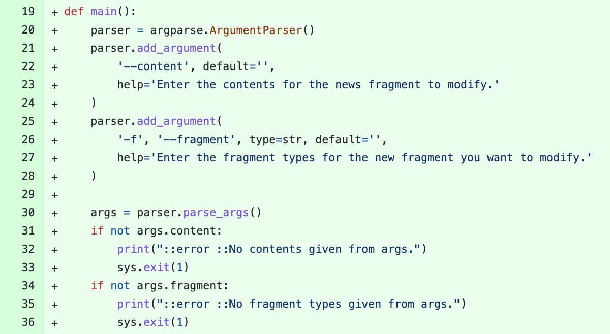
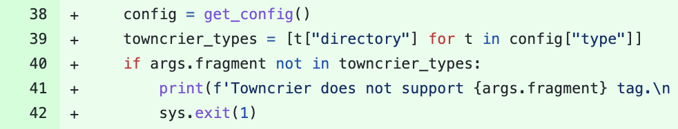
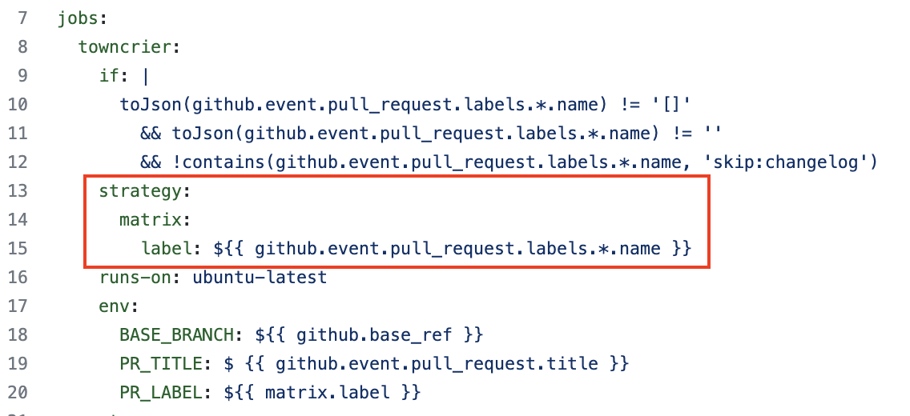
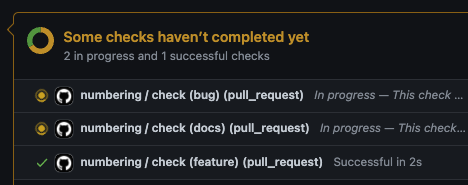

## Issue Contents [#742](https://github.com/lablup/backend.ai/issues/742)
프로젝트에 새롭게 기여하는 컨트리뷰터들에게 news fragment 작성 방법을 설명하는 번거로움을 덜기 위하여
PR제목을 수정할 경우 towncrier news fragment를 자동으로 생성/수정하도록 workflow를 구현하자.
- PR에 assign된 label과 매칭되는 news fragment를 가져오고, PR 제목이 변경될 경우 그 내용을 자동으로 수정/commit/push한다
- assign된 label이 없는 경우는 workflow를 수행하지 않는다
- label과 매칭되는 news fragment가 없는 경우 workflow는 failure를 뱉어야 한다
- news fragment가 존재하지 않는 경우, 현재의 PR제목으로 news fragment를 생성해주자

<br>

## Ideation & Issue Solving
- news fragment를 생성 및 수정하는 파이선 스크립트 파일을 생성하고, `ArgumentParser`를 사용하여 변경할 내용(--content) / 매칭여부를 확인할 label(-f, --fragment)을 인자로 전달할 수 있도록 구현. ([7e3320](https://github.com/lablup/backend.ai/pull/762/commits/7e3320f7a9501bda837ea0b8bcf016297cf3c4e0))
*scripts/update-news-fragment.py*


- `pyproject.toml`에 정의된 `towncrier` 설정값을 가져오는 함수를 작성. → `tomli` module 사용. 전달된 label값이 config에 정의되어 있는 news fragment tag가 아닌 경우는 바로 스크립트를 종료하도록 예외처리를 구현. ([33b854](https://github.com/lablup/backend.ai/pull/762/commits/33b854eaaed1454b357d389d5c5af31288ce544a))
*scripts/update-news-fragment.py*

- PR의 label을 action workflow의 matrix vector로 설정하여, 각각의 label에 대하여 스크립트가 실행될 수 있도록 구현. ([c95c1d](https://github.com/lablup/backend.ai/pull/762/commits/c95c1d100e98dddb7eca5c7818074fe9644587f1) [5bbfec](https://github.com/lablup/backend.ai/pull/762/commits/5bbfec24c08b1d8d512550ad838decabeec3429f))
*.github/workflow/timeline-check.py*

*각각의 Vector에 대한 action을 독립적으로 수행*


<br>

## Pull Request Review
- <text style="color:red;"><b>Closed</b></text> ([#762](https://github.com/lablup/backend.ai/pull/762))

<br>

## 
``` toc 
```