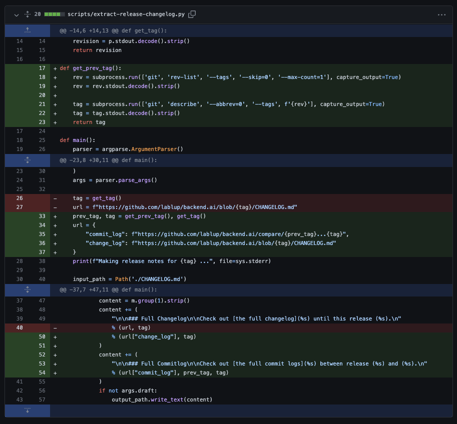

## Issue Contents [#691](https://github.com/lablup/backend.ai/issues/691)

release note(`CHANGELOG.md`)에 커밋 히스토리 기록을 추가하도록 `scripts/extract-release-changelog.py`를 수정한다.

<br>

## Ideation & Issue Solving
이전에 release된 버전의 tag와 현재 release된 버전의 tag를 얻어와서, 전체 커밋 히스토리를 조회할 수 있는 링크를 CHANGELOG에 추가하면 될 것 같았다. 기능상으로 유의미한 변화를 가져오지는 않지만, 사용자(오픈소스 기여자 및 프로젝트 관리자) 편의성을 충분히 개선시킬 수 있는 작업이라고 생각했다.

- 스크립트 내부에서 git shell command를 실행하기 위해 `subprocess` 라이브러리(파이선 스크립트에서 다른 프로세스를 실행, 출력할 수 있다)를 사용 ([1a3063](https://github.com/lablup/backend.ai/pull/721/commits/1a3063b6aba73dce499265d79b81271397cd81d3))
- 이전~현재 버전 사이의 커밋 히스토리는 `/compare/{prev_tag}...{current_tag}` 링크를 통해 조회할 수 있었다. 스크립트를 실행하면 생성되는 `CHANGELOG_RELEASE.md`에 해당 링크가 추가되도록 수정했다. ([1a3063](https://github.com/lablup/backend.ai/pull/721/commits/1a3063b6aba73dce499265d79b81271397cd81d3))
*scripts/extract-release-changelog.py*


## 주요 변경/개선 사항
- 반영완료 [#721](https://github.com/lablup/backend.ai/pull/721)

<br>

``` toc 
```