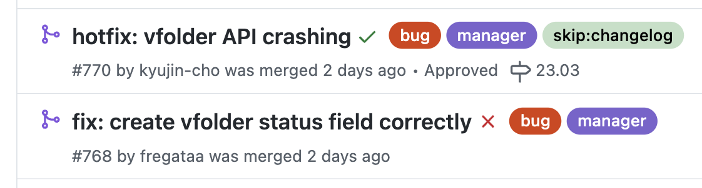
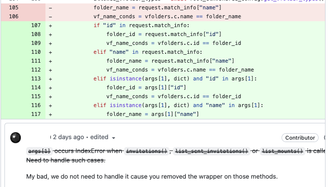

얼마전, 오픈소스에 하나의 PR을 머지시켰다.  
다음날 레포를 확인해보니, 내가 merge시킨 기능과 관련한 hotfix가 2개나 열려있었다..  

 

## [#768](https://github.com/lablup/backend.ai/pull/768). create vfolder status correctly

첫번째로 새로 추가한 컬럼(`vfolder.status`)의 default value 설정값과 관련하여 버그가 발생한 듯하다.
python sqlalchemy에서는 다음과 같은 포맷으로 table과 column을 관리한다.

테이블에 컬럼을 추가하는 작업을 진행할 때, 컬럼의 기본값을 지정해주기 위해 `default` 인자를 사용했다. 하지만 이미 존재하던 테이블에 새로운 컬럼을 추가한 것이므로, 새로운 데이터를 생성할 때 뿐만 아니라 기존에 table에 존재하던 데이터에 이 속성의 값을 어떻게 설정해주어야 할지까지 고려했어야 했다. 따라서 "없던 속성을 새로 추가한 상황"에서는 단순히 컬럼의 기본 속성값을 지정해주는 `default`가 아닌, 해당 속성을 가지고 있지 않던 데이터에도 기본값을 저장하도록 `server_default` 인자를 사용했어야 했다.

 

## [#770](https://github.com/lablup/backend.ai/pull/770). vfolder API crashing

vfolder를 filtering하는 decorater를 모든 API handler에 추가한 것에서 충돌이 난것 같다.
프로젝트 소스코드에 대한 이해능력이 부족해서 인지하지도 못하고 있던 문제다. 새로운 기능을 추가하는 것인 만큼 기존 오퍼레이션들의 인자 하나하나까지 다 확인하여 예외처리를 구현했어야 했다.

 

