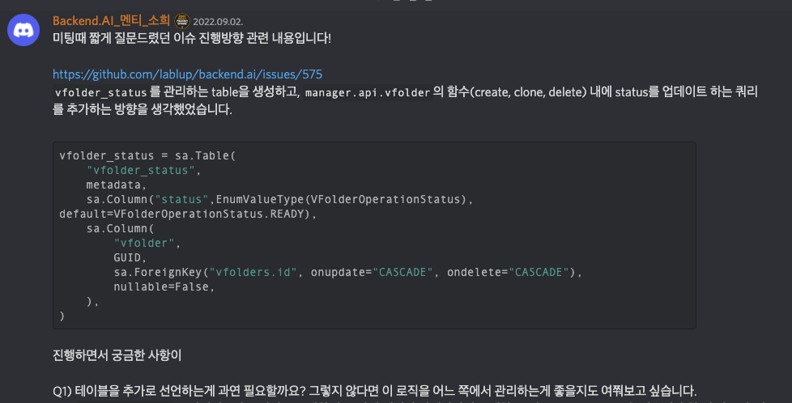
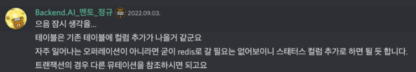
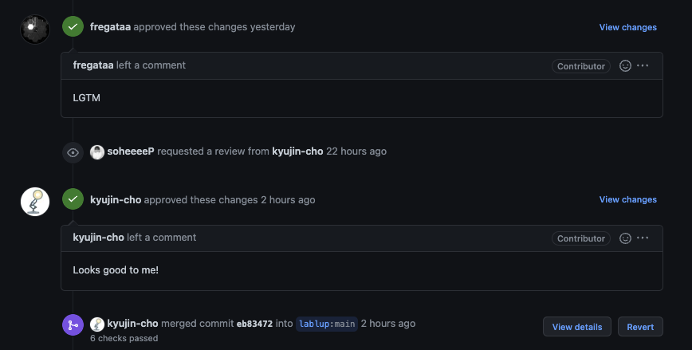

## Issue Contents [#575](https://github.com/lablup/backend.ai/issues/575)

vfolder clone, delete와 같은 storage-proxy operation 작업을 수행할 때, 사용자의 접근을 제어할 수 있도록 vfolder 상태값을 관리하려고 한다.

<br>

## Ideation & Issue Solving
- status값을 관리하기 위한 `Enum`값을 생성하고 이 값을 field로 가지는 `VFolderStatus` table을 생성한다. 새로 생성한 테이블은 FK로 vfolder table을 참조하도록 하자.
- manager의 vfolder api에 정의된 operation(create, clone, delete)에 vfolder status값을 관리하는 쿼리를 추가하자. 
- vfolder status에 따라 사용자 접근을 제어하기 위해서 어떤 방법을 사용할까?

<br>

## Pull Request Review
- 테이블을 추가로 선언하는 것이 과연 필요할까? 라는 의문이 들어서, 이슈 작업을 시작하기 전에 멘토님께 아래와 같은 내용을 문의드렸다. 자주 일어나는 오퍼레이션이 아니므로, column을 추가하는 방향이 나을 것 같다는 의견을 주셨다. 따라서 기존 `VFolder table`에 status column을 추가하는 방향으로 진행하기로 결정

- 오퍼레이션 내부에 insert, update, select query문을 작성한다.

- 처음엔 오퍼레이션 내부에서 query transaction을 적용하는 방향으로 진행하려 했었는데, 이 경우는 vfolder에 접근할 수 없는 경우(ex. vfolder delete가 작동중인데, renaming 요청이 들어온 경우)라도 함수 내부에서 예외 처리를 해주어야 했다. 아예 오퍼레이션 자체를 시작할 수 없게 하도록 lock을 걸고 싶었으므로, <b>status를 filtering하는 wrapper method를 작성하고, operation에 decorater를 선언</b>하는 방향으로 진행하는 것이 좋을 것 같았다.


*이슈 진행방향*

*멘토님 가이드*

<br>

## 주요 변경/개선 사항
- `VFolderOperationStatus` Enum 생성 및 vfolder table column 추가 ([c54d8d](https://github.com/lablup/backend.ai/pull/713/commits/c54d8df53509be61483e9949e0f0c1d138783fb3))
- vfolder status를 확인하는 wrapper method 생성, status check가 필요한 operation에 decorator(@) 선언 ([9c0ef5](https://github.com/lablup/backend.ai/pull/713/commits/9c0ef5121635357d3beac21d56a406fd5e09d0a8) [96e5a7](https://github.com/lablup/backend.ai/pull/713/commits/96e5a7d346bc056b586c0d46124859fa88708b3f))
- operation 내부에 status를 관리하는 query를 추가 ([96e5a7](https://github.com/lablup/backend.ai/pull/713/commits/96e5a7d346bc056b586c0d46124859fa88708b3f))
- 변경한 db scheme에 대한 `albembic` migration script 생성 ([f5cdd1](https://github.com/lablup/backend.ai/pull/713/commits/f5cdd18b7f0507bba808eb062b437dec850b7598))

<br>

## 리뷰 내용 [#713](https://github.com/lablup/backend.ai/pull/713)

- 함수의 의도를 더 직관적으로 나타낼 수 있도록 wrapper method와 parameter명을 수정 ([9d2b71](https://github.com/lablup/backend.ai/pull/713/commits/9d2b714cb88e56bb9f2643f7b6ead8c034445896))

- `VFolderOperationStatus`값 수정 ([5379d1](https://github.com/lablup/backend.ai/pull/713/commits/5379d1e8038852209932cc7de1610a59714fb278))
    - vfolder operation이 수행 중인 경우를 나타내는 값을 `PREPARED` → `PERFORMING`으로 수정
    - vfolder 삭제 후의 상태를 나타내기 위해 DELETED 추가
    - vfolder의 현재 상태와 오퍼레이션 수행을 위해 필요로 하는 상태값을 구분하기 위해 `VFolderAccessStatus` Enum 추가
- ready-to-read(`READABLE`), ready-to-alter(`UPDATABLE`) 동작을 구분 ([ad23f3](https://github.com/lablup/backend.ai/pull/713/commits/ad23f376bfb5aa378196438c457522d92a46dee2))
- wrapper를 통해 parameter값으로만 전달되며, db scheme에는 반영되지 않도록 구현 (vfolder 현재 상태값을 구분하기 위해서만 사용 ([5fb9a0](https://github.com/lablup/backend.ai/pull/713/commits/5fb9a05368b811f333d64a3c3343af0ffbd65768))
- ready-to-read 오퍼레이션에(`READABLE`)도 status filtering decorator를 추가하도록 수정 ([c14de5](https://github.com/lablup/backend.ai/pull/713/commits/))
- clone 오퍼레이션에서 vfolder 상태를 수정하는 쿼리분을 `_clone_bgtask()` 함수 내부로 이동. background task가 완료된 직후에 쿼리를 수행할 수 있도록 수정하여 vfolder가 하나 또는 그 이상의 세션에 마운트되었을 경우, 오퍼레이션 수행을 제한하는 부분을 구현 ([27151f](https://github.com/lablup/backend.ai/pull/713/commits/27151f5988dd4f54d89744965b2b0db6177e95ba))
- DB 스키마 수정에 따른 alembic migration merge 수행 ([348f4b](https://github.com/lablup/backend.ai/pull/713/commits/348f4b65b3891d4d84a5ebcb28177d67245e4fc8))

<br>

*완료*


## 
``` toc 
```