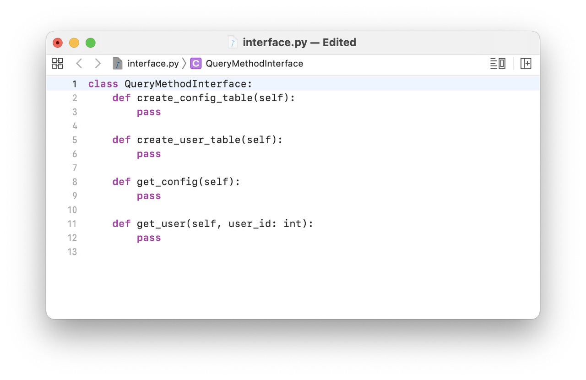
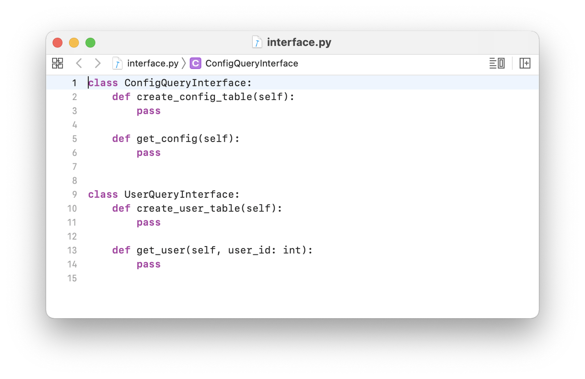
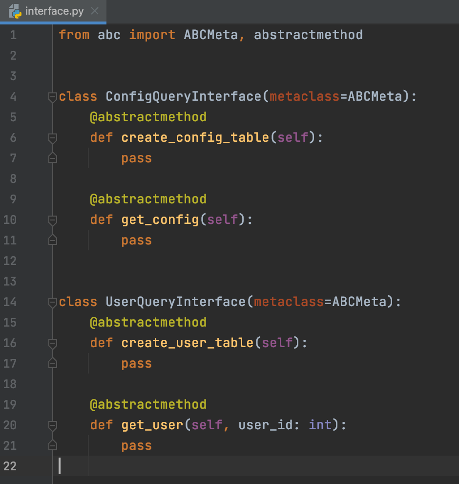
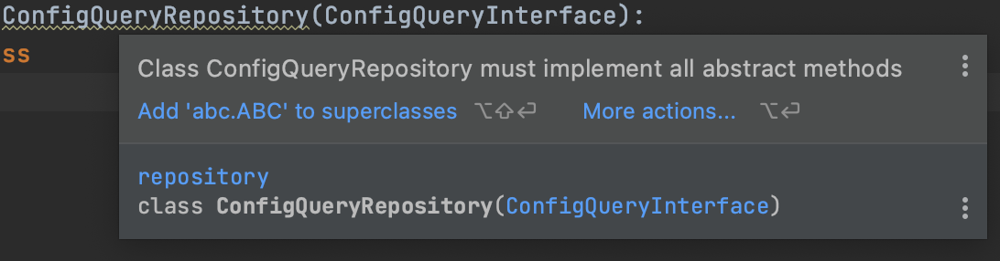
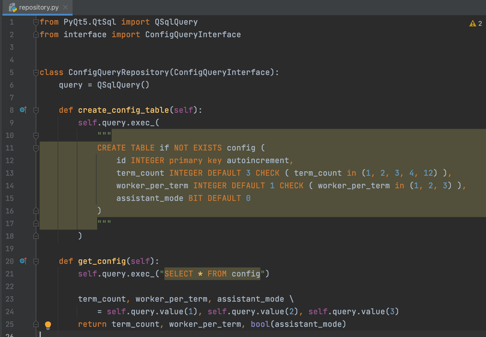
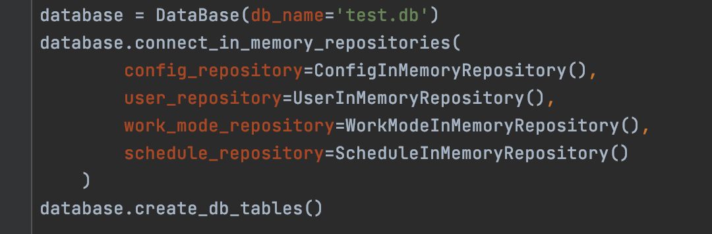
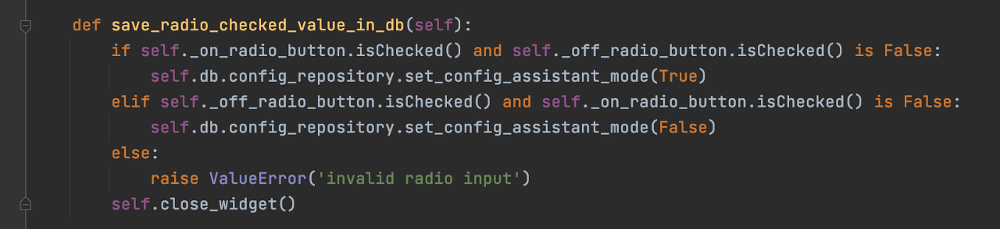

## 개요

db에는 여러 종류의 table이 존재하며, 서비스의 business layer에서는 필요에 따라 각 table에 접근하여 query를 수행해야 할 것이다. ORM같은 프레임워크 툴을 사용하지 않고 raw query를 전부 선언하여 사용하는 경우, 이 query들을 어떻게 작성하는게 좋을까? 전부 하나의 class에 method로서 선언하기? create, update등 용도에 따라 분리하기?

`entity`, `interface`, `repository` layer를 각각 추상화하여 코드를 작성하며 내가 그리고자 했던 파이선 아키텍쳐가 어떤 모습이었는지 기록해보려 한다.

<br>

## SOLID 원칙: 객체지향설계 5원칙

로버트 마틴이 2000년대 초반에 명명한 객체 지향 프로그래밍 및 설계에 대한 5원칙이다. 코드의 가독성과 확장성을 위한 가장 기본적인 원칙이라고 볼 수 있다

|Type|Name|Description|
|:----:|:----------------:|:----------------:|
|SRP|단일 책임 원칙 (Single Responsibility Principle)|한 클래스는 하나의 책임만 가져야 한다|
|OCP|개방-폐쇄 원칙 (Open-Closed Principle)|소프트웨어 요소는 확장에는 열려 있으나 변경에는 닫혀 있어야 한다|
|LSP|리스코프 치환 원칙 (Liskov Substitution Principle)|프로그램의 객체는 프로그램의 정확성을 깨뜨리지 않으면서 하위 타입의 인스턴스로 변경할 수 있어야 한다|
|ISP|인터페이스 분리 원칙 (Interface Segregation Principle)|클래스는 자신이 사용하지 않는 메소드에 의존하지 않아야 한다|
|DIP|의존관계 역전 원칙 (Dependency Inversion Principle)|구체화가 아닌 추상화에 의존해야 한다|

<br>

## 인터페이스 분리 원칙(ISP)란?

> <b>인터페이스 분리 원칙(ISP, Interface Segregation Principle)</b>이란, 하나의 클래스(인터페이스)는 그 '책임'에 적합한 메소드만을 가지고 있어야 한다는 원칙이다.

<br>

예를 들어보자. 아래의 코드에는 `config`와 `user`. 두 개의 서로 다른 table에 접근하는 method들이 하나의 클래스에 선언되어 있다. 만약 이 클래스를 `interface`로 상속받는 구현체 클래스를 선언한다면, 우선적으로 필요한 table에 대한 query method 뿐만 아니라 다른 table에 대한 method까지 구현해야 할 것이다. 

즉, 특정 도메인에 속해있지 않은 method에 의존적인 모습을 보이고 있다고 할 수 있다. 물론 구현하지 않고, 위 예제처럼 pass로 돌려버려도 에러를 뱉진 않지만.. 잘 설계된 코드라고 할 수는 없을 것 같다.

*QueryMethodInterface*

<br>
따라서 아래와 같이 두 개의 클래스로 책임을 분리해주었다. 이제 table에 대한 독립적인 query class를 구현할 수 있게 되었다.
여기서 우리가 잊지 말아야 할 포인트는,
ISP란 하나의 `interface`에 하나의 '기능(method)'만 존재해야 한다는 것이 아니라, <b>하나의 '일(TASK)'를 처리하기 위한 모든 '기능(method)'가 포함되도록 구성되어야 한다</b>는 것이다.



<br>

## abc.ABCMeta를 통해 추상 클래스 선언하기

그렇다면 이제 위에서 선언한 클래스를 추상화시켜서 `interface`로서 동작하도록 만들어보자.
`interface`로서 동작할 추상 클래스에 `entity`에 종속적인 query method들을 추상 메소드로 선언해줄 것이다.

`ABCMeta`는 파이선에서 지원하는 추상 metaclass이다. 생성할 추상 클래스에 `metaclass=abc.ABCMeta`를 지정하고, `@abstractmethod` 데코레이터를 붙여서 추상 메서드를 지정할 수 있다.



<br>

## 추상 클래스(interface)를 상속하는 구현 클래스 작성하기

`interface`를 상속하는 `repository`를 구현하고, 프로그램의 메인부에서 `repository` 클래스의 객체를 생성하고 service layer에서는 이 생성된 객체를 호출하여 사용한다. (단, 추상 클래스에 선언된 method는 반드시 전부 구현되어야 한다.)





즉 프로그램에서, 해당 `entity`에 대해 존재하는 <b>유일한</b> `repository`로서 동작하도록 하는 것이다.

*구현 클래스 객체를 db와 연결한 예시*

<br>

예를 들어보자.
내가 config table에 접근하여, 값을 수정하는 update method를 수행하고 싶다면? 반드시 `database.config_repository.__method__`를 통해서만 접근이 가능하게 되는 것이다. 실제로 이 update에 관련된 `__method__`에서 어떤 동작들이 수행되는지는 저 method명으로 추상화되어 있기 때문에 service layer단에서 볼 수 없다. 
아래 소스코드 예시처럼 접근하여 사용하였다.





아키텍쳐에 관심이 많아서 책이나 자료를 찾아보고, 혼자 열심히 고민하며 코드를 구상했고 나름의 기준을 가지고 설계했다.
혼자 A부터 Z까지 결과물을 만들어본게 처음이라..🤯  코드의 유지보수성을 증가시키고 접근성을 용이하게 하자 라는 생각에서 시작된 아키텍쳐 설계가 오히려 단순한 코드를 더 복잡하게 만드는 것은 아닐까 고민하기도 했다. 

<br>

-----
계속 스스로에게 던졌던 질문이다.  
<b><text style="color:black;">"What do we get for this? And what does it cost us?"</text></b>

<br>

## Reference

- https://www.cosmicpython.com/book/chapter_02_repository.html#maps_chapter_02
- https://dojang.io/mod/page/view.php?id=2389 https://realpython.com/python-interface/
- https://realpython.com/python-interface/


<br>

```toc
```