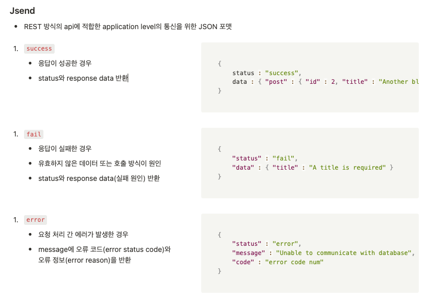
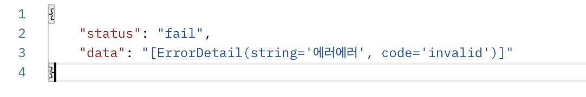
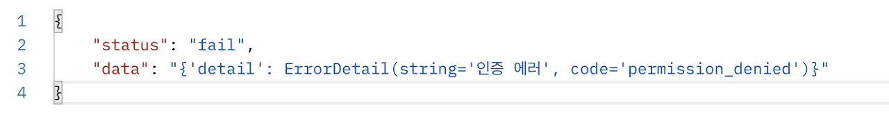
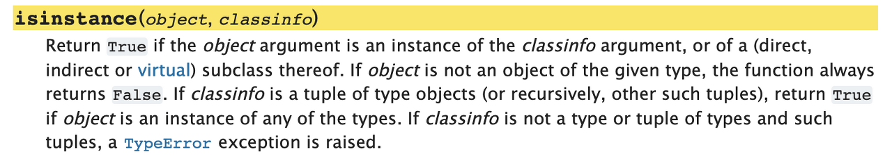
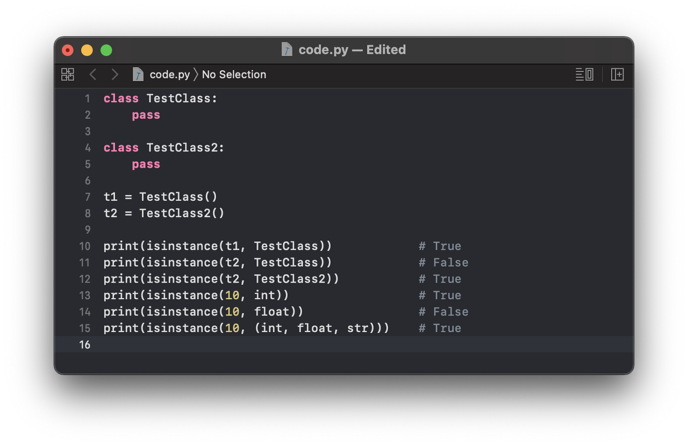
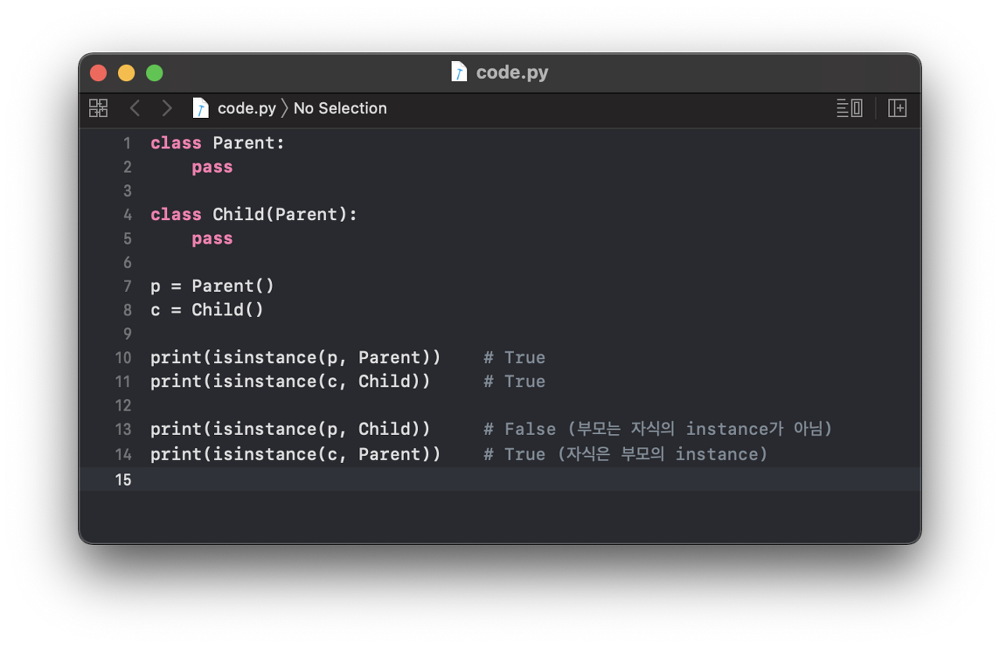
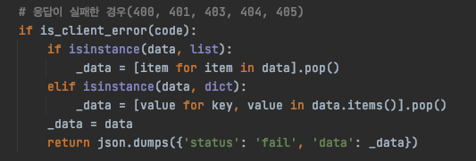

## Django에서 APIException에 대한 응답 데이터를 재구성하기

`Django REST Framework`에서 api response를 커스터마이징하기 위하여 [jsend 포맷](https://github.com/omniti-labs/jsend)을 적용한 renderer를 작성하고 있었다.

*jsend format*

400번대 에러코드를 반환하는 client error들에 대한 format을 작성하려 하는데.. 
아래 예시처럼 400을 반환하는 `ValidationError`와 나머지 400번대 에러들이 반환하는 data의 type이 달랐다. 

*ValidationError*
*PermissionDenied*

처음엔 반환되는 `ErrorDetail` 객체의 변수인 `code`(`ExceptionClass`에 정의된 `default_code`값)를 뽑아와서
400번대 에러를 두 종류로 나누었는데, 특정 에러에 대해서만 이렇게 문자열로 처리를 한다는 것이 영 마음에 들지 않았다.


## Django에서는 예외처리를 위한 data를 어떻게 구현했을까?

Django에서는 `exceptions._get_codes(detail)` 함수를 호출하여 `APIException`에 대한 데이터를 구성하고 있다. 이 함수는 파이선의 built-in method인 `isinstance`를 사용해 data를 구성한다. 이를 활용하여, data type에 따라 경우를 나눠서 처리하도록 원하는 데이터 구조로 커스텀하는 함수를 재작성하면 될 것 같다!

<br>

## 파이선의 내장 함수 활용하기

파이선의 `isinstance` method에 대한 [공식 도큐먼트](https://docs.python.org/3.9/library/functions.html#isinstance)의 설명은 아래와 같다.
instance와 전달받은 특정 class/data의 type이 일치할 때는 True 아닌 경우에는 False를 반환한다.
첫번째 인자로 전달된 객체가 해당 class의 instance가 맞는지, data type이 일치하는지의 여부를 확인할 수 있는 것!

*파이선 공식 도큐먼트에서 설명하고 있는 isinstance method*
<br>

> <b>(예제1)</b> 만약 classinfo가 여러 type object들이 나열된 tuple로 전달된다면,<br>하나라도 일치하는 type이 존재할 때는 True를 반환한다. 
*(예제1)*

> <b>(예제2)</b> 상속관계인 경우, 자식은 부모의 instance이므로 instance가 True값을,<br> 부모는 자식의 instance가 아니므로 False값을 반환한다.  
*(예제2)*


최종적으로 renderer에 작성한 코드는 다음과 같다.




역시 언어에 대한 이해도가 높을수록, 언어를 사용하는 프레임워크에 대한 러닝커브는 강해질 것이라는게 느껴진다.
파이선은 공부하면 할수록 제공해주는 함수와 기능들이 정말 많다. 100분 활용하기 위해서는 코드를 더 까보고, 문서도 읽으면서 공부할 필요가 있다!

<br>

``` toc
```
