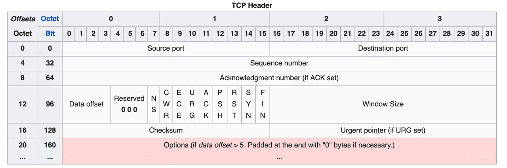

[이전 포스팅: <어떤 API를 사용해야 할까? - REST, GraphQL, 그리고 GRPC>](https://soheeeep.github.io/api-architecture)에서 다양한 API 형식에 대하여 소개했다. 그 중 REST는 `HTTP/1.1` 프로토콜을 기반으로 동작한다면, gRPC는 `HTTP/2.0` 프로토콜을 기반으로 동작한다는 점이 가장 큰 차이점이었다. 

그동안 HTTP와 HTTPS를 **'웹에서 동작하는 어플리케이션을 만들기 위해 정의된 클라이언트-서버 모델의 프로토콜'** 정도의 넓은 개념으로만 이해하고 있었다. 시간의 흐름에 따라 발전해온 HTTP 프로토콜의 버전과 그 특징에 대하여 자세하게 알아보려고 한다.

<br>

## 웹은 어떻게 동작하는가?
인터넷이 메세지를 routing할 수 있는 `IP(Internet Protocol)`을 기반으로 연결된 public한 computer들의 집합이라는 넓은 개념이라면, Web은 이메일, 파일 공유처럼 인터넷을 구성하는 여러 서비스 중 하나라고 말할 수 있다.
> **_IP(Internel Protocol)_:** 송신 호스트와 수신 호스트 사이에서 패킷이 네트워크를 통해 이동할 수 있도록 데이터를 라우팅하는 네트워크 계층의 프로토콜

각 서비스에 대하여 인터넷을 통해 메세지를 라우팅하고 리소스를 주고받기 위한 표준과 프로토콜이 존재한다.
이메일이 `SMTP, IMAP, POP 프로토콜`을 이용한다면, web은 `HTTP`을 통해 멀리 떨어진 다른 서버에 대한 리소스를 요청하고 응답받는다.

<br>

## HTTP의 정의와 동작 방식

`HTTP(Hypertext Transfer Protocol)`은 여러 종류의 파일(문서에 대한 링크, 이미지와 같은 다양한 형태)을 주고받는 프로토콜이다. HTTP는 신뢰성 있는 네트워크를 기반으로 동작하고, 여러 계층으로 나누어 통신을 수행한다. 각 계층은 독립적이지만 논리적으로 연결되어 있다. 

*가장 보편적으로 적용되는 OSI(Open Systems Interconection) 7계층 모델*

<br>

### 전송(Transport) 계층의 프로토콜, TCP와 UDP

데이터를 주고받는 전송 계층의 프로토콜 중 가장 대표적인 것에는 `TCP(Transmission Control Protocol)`과 `UDP(User Diagram Protocol)`이 있다. IP를 통해 전달되는 패킷에 대한 오류 검출, 재전송 요구 제어 등을 수행하여 데이터를 전달해주는 역할을 수행한다.

|   | TCP | UDP |
|:--:|:--- |:---|
| 연결 방식 | 연결형 서비스 | 비연결형 서비스 |
| 패킷 교환 | 가상회선 방식 | 데이터그램 방식 |
| 전송 속도 | 느림 | 빠름 |
| 연결 설정 | handshaking을 통해 연결을 설정하고<br>해제하는 과정이 존재하지 않음 | 연결을 설정하기 위한<br>별도의 과정이 존재하지 않음 |
| 신뢰성 | 데이터의 전송순서를 보장하며, <br>신뢰성이 높음 | 데이터의 전송순서를 보장하지 않으며,<br>신뢰성이 낮음 |

위의 표를 통해 **TCP는 신뢰성이 높지만 상대적으로 느린, UDP는 신뢰성이 낮지만 상대적으로 빠른 프로토콜**이라고 정리할 수 있다. TCP는 전송되는 데이터 패킷들의 순서를 보장하고, 패킷 손실 여부 등을 검사하여 송신 측에서 보낸 데이터가 수신 측에 온전하게 전달되는 것을 보장한다.

<br>

### HTTP/1.0

`HTTP/1.0`에서는 문서뿐만 아니라 이미지, CSS와 같이 다양한 파일을 주고 받을 수 있다.  
- **하나의 TCP 연결에 대해 하나의 요청을 처리할 수 있도록 구현**되어있다. 세션을 유지하지 않으므로, TCP 연결을 지속하려면 `Connection: keep-alive` 헤더를 설정해야 해주어야 하는 `Non-Persistent` 프토토콜이다.
- **`Pipelining`을 제공하지 않아 하나의 요청에 대한 응답을 받은 후에 다른 요청을 수행할 수 있으므로**, `RTT(Round Trip Time)`이 증가하고 network latency가 발생하게 된다.
- **하나의 IP 주소에 대하여 여러 도메인을 운영할 수 없고**, 클라이언트와 서버 사이에 proxy가 위치하는 경우 **proxy가 클라이언트에 대한 인증을 수행할 수 없다**는 한계가 있었다.

<br>

### HTTP/1.1

`HTTP/1.0`과 가장 크게 달라진 점은 **TCP 연결의 지속성**이다.  
- **별도의 헤더를 설정하지 않고도 지정된 timeout 동안은 연결을 유지**한다. 또한 요청마다 TCP 연결을 수립해야 하는 `HTTP/1.0`과 달리, 한 개의 TCP 세션을 통해 여러 요청을 처리하여 부하를 줄일 수 있게 `Persistent`한 프로토콜로 개선되었다.
- **연결 내에서 응답을 기다리지 않고 순차적으로 여러 요청을 보낼 수 있는 `Pipelining`이 적용**되며 network latency가 개선되었다.
- Host 헤더를 추가하여 **하나의 IP에 여러 도메인을 운영하는** `Virtual Hosting`이 가능해졌다.
- `proxy-authentication`, `proxy-authorization` 헤더를 사용하여 proxy도 클라이언트에 대한 인증을 수행할 수 있게 되며 **인증절차가 강화**되었다.
- 새로운 상태 코드가 추가되고, caching이 개선되는 등 전체적인 성능이 향상되었다.


<br>

### HOLB(Head of Line Blocking)

기본적으로 `HTTP/1`에서는 TCP 프로토콜을 사용하므로, 패킷은 무조건 전송받은 순서대로 처리되는 것이 보장된다. 수신 측은 송신 측과 sequence 번호를 주고받으며 순서대로 패킷을 재조립하고, 패킷이 손실 또는 유실되었을 경우 재전송을 수행하게 된다. 요청이 처리되는 순서가 정해져 있으므로, 이전에 받은 패킷을 파싱하기 전가지는 다음 패킷을 처리할 수도 없어서 `Pipelining`을 활용하는 것 또한 쉽지 않다. 이렇게 **패킷이 유실되거나 송신 측의 전송 속도와 수신 측의 패킷 처리 속도가 상이한 경우 발생하는 병목현상**을 `HOLB(Head of Line Blocking)`라고 부른다.

또한 TCP에서는 신뢰성 있는 연결을 위해 handshaking을 반복적으로 수행하기 때문에 여전히 불필요한 `RTT(Round Trip Time)`, 이에 따른 네트워크 지연이 발생한다는 문제도 남아있다.

### 다수의 요청으로 인해 무거워지는 Header

클라이언트와 서버 사이의 요청을 처리할 때마다 헤더를 중복해서 전송하며 불필요한 데이터를 주고받게 된다. cookie 정보 또한 매 요청마다 헤더에 포함되어 전송하므로 네트워크 자원이 낭비되는 문제가 발생한다.

<br>

## HTTP/2의 출현

방대해지는 데이터, multi-media 리소스 처리비용의 증가, 비동기 처리에 대한 소요 증가 등 웹이 고도화됨에 따라 `HTTP/1.1`의 한계는 더욱 명확해졌다.

<br>

두 개의 이미지가 있는 하나의 정적인 웹 페이지를 로딩하는 과정을 예시로 들어 하나의 요청을 처리하는데 소요되는 시간을 50ms, 정적인 이미지를 받아오는 시간을 10ms라고 하자.
페이지를 로딩하기 위해서는 360ms가 소요되는 반면, 그 중 실제로 요청을 처리하는 시간은 60ms에 불과하다. 하나의 요청이 완료되기 전까지는 다음 요청을 처리할 수 없으므로 거의 80% 이상의 시간이 메세지를 기다리는 시간으로 낭비되는 것이다. 


아래는 위의 예시에 `Pipelining`을 적용한 것이다. 위의 예시와 비교하면 성능의 향상은 이루어졌다고 볼 수 있지만, 여전히 낭비되는 시간이 많다. 또한 실제 운영환경의 웹 사이트는 훨씬 많은 데이터를 담고 있기 때문에, 지연은 더욱 커질 것이고 이에 따라 성능은 더욱 저하될 것이다.


<br><br>

당시 새로운 해결책은 더 많은 TCP 연결을 여는 것이었다. 각 connection들은 서로 독립적으로 동작하므로 `Pipelining`이나 `HOLB`에 따른 문제를 해결할 수 있었고 병렬성을 적용하여 HTTP 헤더가 방대해지는 문제도 어느 정도 해결할 수 있었다.
또한 이미지, `CSS`, `JS`와 같은 static 리소스들을 서브 도메인에서 처리하도록 하는 `Domain Sharding`, HTML 문서 내의 이미지 리소스를 Base64로 인코딩된 이미지 데이터로 직접 작성하여 네트워크 요청을 줄이는 방법 등 다양한 성능 개선을 시도했다.

하지만 이러한 해결책의 한계는 명확했다. 클라이언트와 서버 사이의 connection이 증가하며 발생하는 overhead, TCP 연결을 수립하는 과정에서 발생하는 네트워크 지연, 연결을 유지하기 위해 소모되는 메모리와 processing 비용 등 다양한 요소들이 아직 해결하지 못한 과제로 남아있었다.

<br>

이후 2015년, Google의 SPDY 프로토콜을 기반으로 한 `HTTP/2.0`이 출현하였다. `HTTP2` 공식 깃허브의 README에 기술된 내용에 따르면, <text style="color:#000066;">**`HTTP/2.0`은 완전히 새로운 프로토콜이 아닌 성능 향상에 초점을 맞춘 버전**</text>이다.  

> "HTTP/2 is a replacement for how HTTP is expressed “on the wire.” It is not a ground-up rewrite of the protocol; HTTP methods, status codes and semantics are the same, and it should be possible to use the same APIs as HTTP/1.x (possibly with some small additions) to represent the protocol. **The focus of the protocol is on performance; specifically, end-user perceived latency, network and server resource usage.** One major goal is to allow the use of a single connection from browsers to a Web site."

`HTTP/2` 명세인 [RFC 7540](https://httpwg.org/specs/rfc7540.html)은 2015년 5월 발행된 뒤 구현, 배포되었다.

<br>

### Multiplexed Streams을 통한 Pipelining의 개선

**TCP 연결 한 개로 동시에 여러 메세지를 주고받을 수 있게 되었다.** 요쳥 순서에 관계없이 Stream을 통해 클라이언트와 서버는 양방향으로 Message를 주고 받을 수 있다. 즉 하나의 연결 안에서 여러 개의 Stream을 사용하므로, 특정 Stream의 패킷이 손실된 경우라도 나머지 Stream에는 영향을 미치지 않는다.

`HTTP/2.0`을 기반으로 동작하는 `gRPC`의 경우, 필요에 따라 Stream을 적용하는 방식을 정의할 수 있다.
- 클라이언트에서 서버로 stream을 전달하고, 서버에서는 한 번 응답하는 `Client-side Streaming`
- 클라이언트에서 한 번 전달, 서버에서는 stream으로 응답하는 `Server-side Streaming`
- 클라이언트와 서버 모두에서 stream으로 요청, 응답하는 `Bidirectional Streaming`

``` go
// stream을 사용해 통신방식을 정의하여 gRPC Service를 생성
service Data {
    // client-stream: 클라이언트에서 서버로 stream을 전달하고, 서버에서는 한 번 응답
    rpc GetData(stream GetRequest) returns (GetResponse);
    // server-stream: 클라이언트에서 한 번 전달, 서버에서는 stream으로 응답
    rpc GetData(GetRequest) returns (stream GetResponse);
    // bidirectional stream: 클라이언트와 서버 모두에서 stream으로 요청, 응답
    rpc GetData(stream GetRequest) returns (stream GetResponse);
}
```

### Stream Prioritization: 리소스 간의 의존관계를 정의

클라이언트가 요청한 HTML 문서에 CSS와 이미지 파일이 존재하는 경우를 예로 들어볼 떄, CSS파일의 우선순위가 높게 설정되어 있어야 성능이 개선될 것이다. 이미지 파일보다 CSS 파일이 늦게 로딩된다면 브라우저의 렌더링이 늦어지는 문제가 발생할 수 있기 떄문이다. 
`HTTP/2.0`은 이러한 방식으로 리소스 간의 의존관계(우선순위)를 설정하여 브라우저 랜더링 문제를 해결하였다.

### Server Push를 통한 클라이언트 요청 최소화


클라이언트가 요청하지 않았지만, HTML 문서에 포함되어 있는 리소스라도 서버 측에서도 Push할 수 있다. 이를 통해 클라이언트 요청을 최소화하여 성능이 개선될 수 있다. 

### Header Compression을 통한 불필요한 부하 감소


기존 `HTTP/1`에서는 매번 요청을 처리할 떄마다 헤더를 중복해서 전송하며 네트워크 자원이 낭비되는 문제가 존재했다. `HTTP/2.0`에서는 HPACK 압축방식을 통해 헤더 정보를 압축하여 전송할 수 있다. `Header Table`을 통해 중복 헤더를 검출하고, 중복되지 않은 헤더 정보들에 대해서만 `Huffman Encoding` 기법을 적용하여 전송한다.

<br>

하지만 `HTTP/2.0`도 여젼히 TCP 프로토콜을 기반으로 동작하기 때문에 `RTT(Round Trip Time)`으로 인한 네트워크 지연이나 TCP로 인한 `HOLB(Head of Line Blocking)` 문제를 온전히 해결할 수는 없다.

<br>


## UDP를 기반으로 한 HTTP/3의 출현

TCP는 기본적으로 클라이언트와 서버 사이에서 신뢰성 있는 통신을 보장하는 프로토콜이다. 회선의 대역폭(Bandwidth)를 늘린다 해도, 데이터의 크기가 커지면 언젠가는 또 지연이 발생할 것이고, 회선의 전송 속도를 높인다고 해도 광속보다 빠르게 전송할 수 없다는 한계가 있다. 또한 이미 TCP 자체가 너무 고도화된 프로토콜이기 때문에, 이제와서 프로토콜을 손보기에는 너무 많은 비용을 소모해야 한다.

*거의 모든 필드를 사용하고 있는 TCP 헤더의 모습*

<br>

### UDP 기반으로 동작하는 프로토콜, QUIC

TCP가 가진 근본적인 문제들을 해결하고 latency의 한계를 뛰어넘고자 등장한 UDP 기반의 전송 프로토콜이 등장하였다. 2012년부터 구현 및 적용된 Google의 `QUIC(Quick UDP Internet Connections)`이다.

하지만 UDP는 상대적으로 빠르지만 신뢰성 있는 통신을 보장할 수 없는 프로토콜이라고 하는데, 이러한 문제는 어떻게 해결한 것일까?

*데이터 전송에 초점을 맞추고 있어, 아직 커스텀할 공간이 많은 UDP 헤더의 구조*

UDP는 데이터 전송에 초점을 맞추고 설계되어 있어, 별도의 기능이 없다. 이말은 어떻게 개발하느냐에 따라서 TCP만큼 신뢰성을 갖춘 프로토콜로도 고도화 할 수 있다는 의미를 내포한다.

<br>

### 연결 수립시 발생하는 지연(latency) 감소

기존에 TCP를 사용하여 HTTPS 연결을 생성하는 경우에는 1) `3-Way Handshake`를 통한 연결 생성 2) `TLS` 설정을 위한 `SSL Handshake`까지 총 3번의 `RTT(Round Trip Time)`을 필요로 한다.  
반면 `QUIC`의 경우 UDP를 기반으로 하는 데이터그램 방식의 프로토콜이기 때문에 패킷의 전송 순서를 고려할 필요가 없다. 서버와는 `Connection UUID`라는 고유한 identifier로 연결되므로 연결 수립과 해제를 위한 별도의 handshaking 과정이 필요하지 않다. 처음 연결을 수립할 때 암호화를 위한 데이터도 한 번에 전송해버릴 수 있기 때문에 1번의 `RTT(Round Trip Time)`만으로 통신을 할 수 있게 된다.

### Connection ID를 사용하여 연결을 생성

TCP의 경우, 클라이언트가 변경되면 서버는 handshaking을 통해 매번 새로운 연결을 수립해야 한다. `QUIC`의 경우, `Connection UUID`를 사용하여 서버와 연결을 생성한다. `UID`라는 단어에서 파악할 수 있듯이 클라이언트와는 무관한 랜덤한 값으로, 연결을 위한 고유의 식별자로서 동작한다. 따라서 클라이언트가 변경된다 하더라도 기존의 연결을 유지할 수 있게 된다.

### Multiplexing을 통한 HOLB(Head of Line Blocking) 방지

`HTTP/2.0`처럼 `Multiplexing`을 지원한다. 하나의 연결 안에서 여러 개의 Stream을 사용, 특정 Stream의 패킷이 손실된 경우라도 나머지 Stream에는 영향을 미치지 않도록 하여 `HOLB(Head of Line Blocking)` 문제를 방지할 수 있다. 

*HTTP/2.0과 HTTP/3.0의 Multiplexing*

<br>

### Chrome에서 HTTP/3 사용해보기

command line에서 `enable-quic` 옵션을 사용하여 Chrome을 열거나, `chrome://flags#enable-quic`으로 접속하여 `HTTP/3`을 적용해볼 수 있다.


<br>

## References
- [Barry Pollard (2019). HTTP/2 in Action. Manning Publications](https://www.oreilly.com/library/view/http2-in-action/9781617295164/)
- https://blog.cloudflare.com/http3-the-past-present-and-future/
- https://evan-moon.github.io/2019/10/08/what-is-http3/
- https://factoryhr.medium.com/http-2-the-difference-between-http-1-1-benefits-and-how-to-use-it-38094fa0e95b
- https://medium.com/codavel-blog/quic-vs-tcp-tls-and-why-quic-is-not-the-next-big-thing-d4ef59143efd

```toc
```